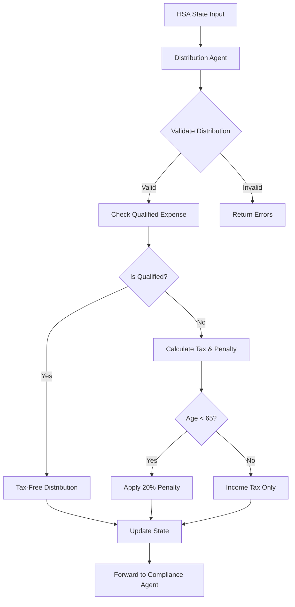

## 2. Distribution Agent Documentation

# HSA Distribution Agent Documentation

## Overview
The Distribution Agent processes HSA withdrawal requests and calculates associated tax implications. It validates distribution amounts, determines if expenses qualify as medical expenses, and computes taxes and penalties according to IRS rules.

## System Architecture Diagram



## Agent Responsibilities

### Primary Functions
- **Distribution Validation**: Validates withdrawal requests against account balance
- **Qualified Expense Determination**: Identifies if distribution is for qualified medical expenses
- **Tax Calculation**: Computes income tax on non-qualified distributions
- **Penalty Assessment**: Calculates 20% penalty for non-qualified distributions (if under age 65)
- **Documentation Requirements**: Ensures proper documentation for medical expenses

### State Management
The agent processes and updates the following state fields:
- `distribution_amount`: The requested distribution amount
- `distribution_reason`: The reason/purpose for the distribution
- `distribution_valid`: Boolean indicating if the distribution is valid
- `distribution_tax_implications`: Detailed tax and penalty calculations

#### Example State
```json
{
    "distribution_valid": true,
    "distribution_amount": 2000.0,
    "distribution_reason": "vacation",
    "distribution_tax_implications": {
        "taxable": true,
        "tax_amount": 440.0,
        "penalty_amount": 400.0,
        "qualified_expense": false,
        "explanation": "Taxable distribution with 20% penalty"
    },
    "compliance_check_result": "VIOLATION",
    "compliance_violations": [
        "User is not eligible for HSA participation",
        "Contribution amount exceeds annual limit"
    ],
    "compliance_warnings": null,
    "workflow_status": "completed",
    "messages": [
        {
            "agent": "ComplianceAgent",
            "message": "Compliance violations detected: User is not eligible for HSA participation; Contribution amount exceeds annual limit",
            "type": "error"
        }
    ]
}
```

## IRS Rules Implemented

### Qualified Medical Expenses
Distributions for qualified medical expenses are tax-free and penalty-free at any age.

#### Qualified Expense Categories
```python
qualified_expenses = {
    "medical_care", "prescription_drugs", "dental_care", "vision_care",
    "hospital_expenses", "doctor_visits", "medical_equipment",
    "health_insurance_premiums", "long_term_care", "mental_health_care",
    "physical_therapy", "medical_devices", "medical_supplies"
}
```

# For non-qualified distributions
tax_amount = distribution_amount * marginal_tax_rate
penalty_amount = distribution_amount * 0.20 if age < 65 else 0.0
total_tax_burden = tax_amount + penalty_amount

if amount <= 0:
    errors.append("Distribution amount must be greater than zero")

if amount > account_balance:
    errors.append(f"Distribution amount exceeds account balance of ${account_balance:,.2f}")

if not reason:
    errors.append("Distribution reason is required")

def _check_documentation_requirements(self, state: HSAState) -> List[str]:
    warnings = []
    if not user_data.get("has_receipts", False):
        warnings.append("Maintain receipts for all medical expenses paid with HSA funds")
    return warnings