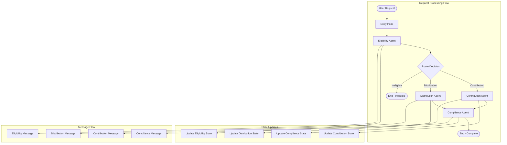

# Agent Flow Diagram for HSA Multi-Agent System

This document provides a visual representation of the flow of information between the different agents in the HSA Multi-Agent System. The agents interact with each other to ensure compliance with IRS rules and manage the HSA processes effectively.

## Diagram Description

- **EligibilityAgent**: Determines if an individual is eligible for an HSA based on IRS rules.
- **ContributionAgent**: Manages contributions to the HSA, ensuring they comply with IRS limits.
- **DistributionAgent**: Handles distributions from the HSA and verifies that expenses are qualified.
- **ComplianceAgent**: Ensures that all actions taken by the other agents comply with IRS regulations.

## Flow of Information

1. **Eligibility Check**: The process begins with the EligibilityAgent assessing the individual's eligibility.
2. **Contribution Management**: If eligible, the ContributionAgent manages the contributions to the HSA.
3. **Distribution Handling**: When distributions are requested, the DistributionAgent checks for qualified medical expenses.
4. **Compliance Verification**: Throughout the process, the ComplianceAgent monitors all actions to ensure adherence to IRS regulations.

## Diagram


*Note: Replace `path/to/agent_flow_diagram.png` with the actual path to the diagram image file.*

## 3. Add Agent Flow Documentation

```markdown
# HSA Agent Flow Documentation

## Agent Interaction Flow

