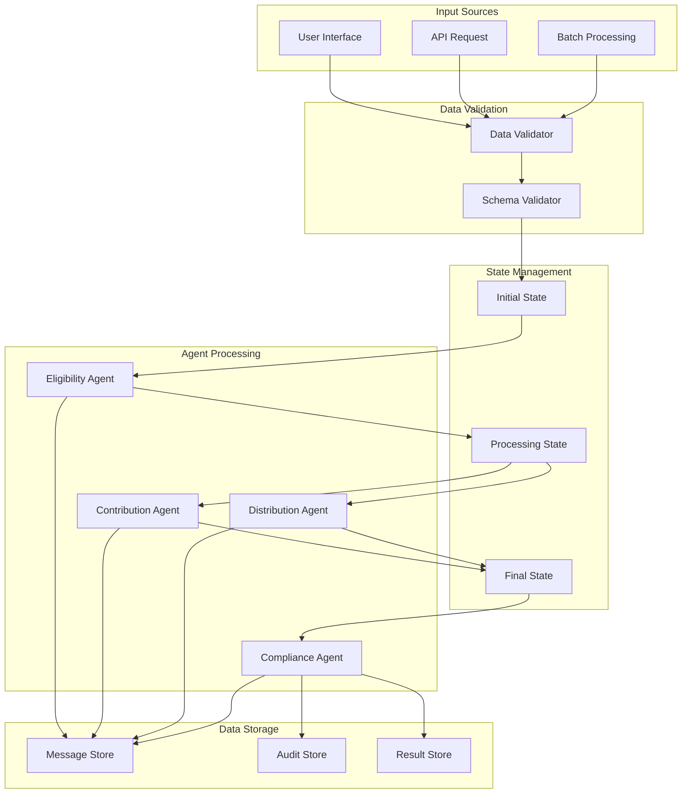

# Data Flow Diagram for HSA Multi-Agent System

## Overview
This document outlines the data flow within the HSA Multi-Agent System, illustrating how data is processed and transferred between various components of the system.

## Data Flow Description
1. **User Input**: The process begins with user input, which may include personal information, contribution amounts, and medical expenses.

2. **Eligibility Agent**: 
   - Receives user input.
   - Validates eligibility based on IRS rules.
   - Sends eligibility status to the HSA Workflow.

3. **Contribution Agent**: 
   - Receives contribution data from the user.
   - Checks compliance with IRS contribution limits.
   - Sends confirmation of contribution to the HSA Workflow.

4. **Distribution Agent**: 
   - Receives requests for distributions.
   - Validates that the expenses are qualified medical expenses.
   - Sends distribution approval status to the HSA Workflow.

5. **Compliance Agent**: 
   - Monitors all actions taken by the other agents.
   - Ensures compliance with IRS regulations.
   - Reports compliance status back to the HSA Workflow.

6. **HSA Workflow**: 
   - Orchestrates the interactions between agents.
   - Collects data from all agents and processes it to determine the overall status of the HSA operations.
   - Outputs final results to the user.

## Diagram
[Insert Data Flow Diagram Here]

*Note: The diagram visually represents the flow of data between the components described above. It should include arrows indicating the direction of data flow and labels for each component involved in the process.* 

## 4. Add Data Flow Documentation

```markdown
# HSA Data Flow Documentation

## Overall Data Flow



## Conclusion
This data flow diagram serves as a guide to understanding how data moves through the HSA Multi-Agent System, ensuring clarity in the interactions between different agents and the overall workflow.